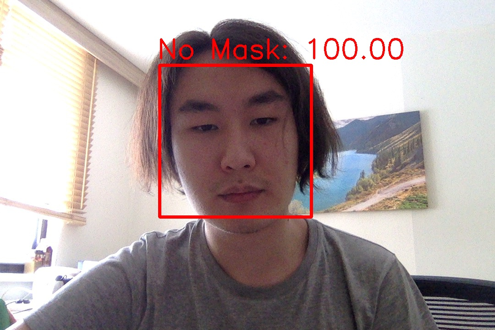

# Mask Detection 
**Author**: *Bauyrzhan Zhakanov*, [bauyrzhan.zhakanov@gmail.com](bauyrzhan.zhakanov@gmail.com)

This is the face mask detection project made during pandemic period. The model trained in Google Colaboratory.

## Model
Model has the following neural networks
```
fullyConnected = trainModel.output         
fullyConnected = tf.keras.layers.AveragePooling2D(pool_size = (7,7))(fullyConnected)
fullyConnected = tf.keras.layers.Flatten()(fullyConnected)
fullyConnected = tf.keras.layers.Dense(128, activation = 'relu')(fullyConnected)
fullyConnected = tf.keras.layers.Dropout(0.5)(fullyConnected)
fullyConnected = tf.keras.layers.Dense(2, activation = 'softmax')(fullyConnected)
```
## Result
During the training, the model produced 99 in training and validation processes. 
```
25/25 [==============================] - 8s 324ms/step - loss: 0.0154 - accuracy: 0.9959 - val_loss: 0.0323 - val_accuracy: 0.9901
```
Here are the Training and Validation accuracy and losses graph.
<table>
   <tr>
      <td></td>
      <td>
  </td>
  </tr>
</table>

## Output images
<table>
   <tr>
      <td></td>
      <td>
  </td>
  </tr>
</table>
